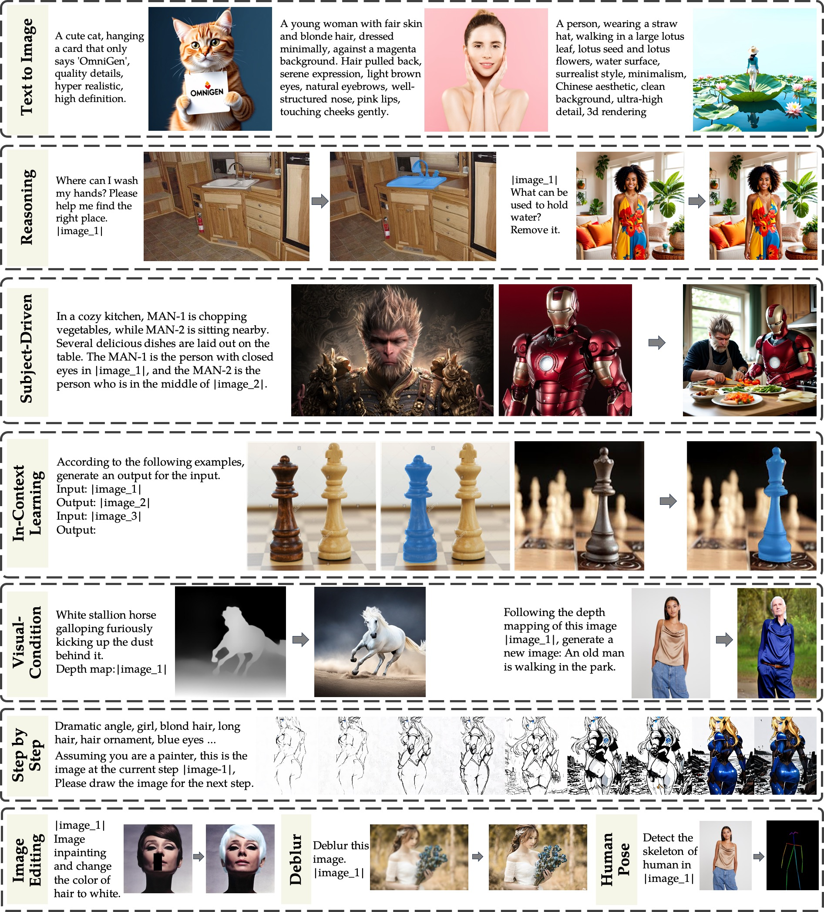

# OmniGen: Unified Image Generation

## Overview

We introduce a novel diffusion framework that unifies various image generation tasks within a single model, eliminating the need for task-specific networks or fine-tuning. ([Paper](https://arxiv.org/pdf/2409.11340))

## Results

## Plan

 - [x] Technical Report
 - [ ] Model
 - [ ] Code
 - [ ] Data
