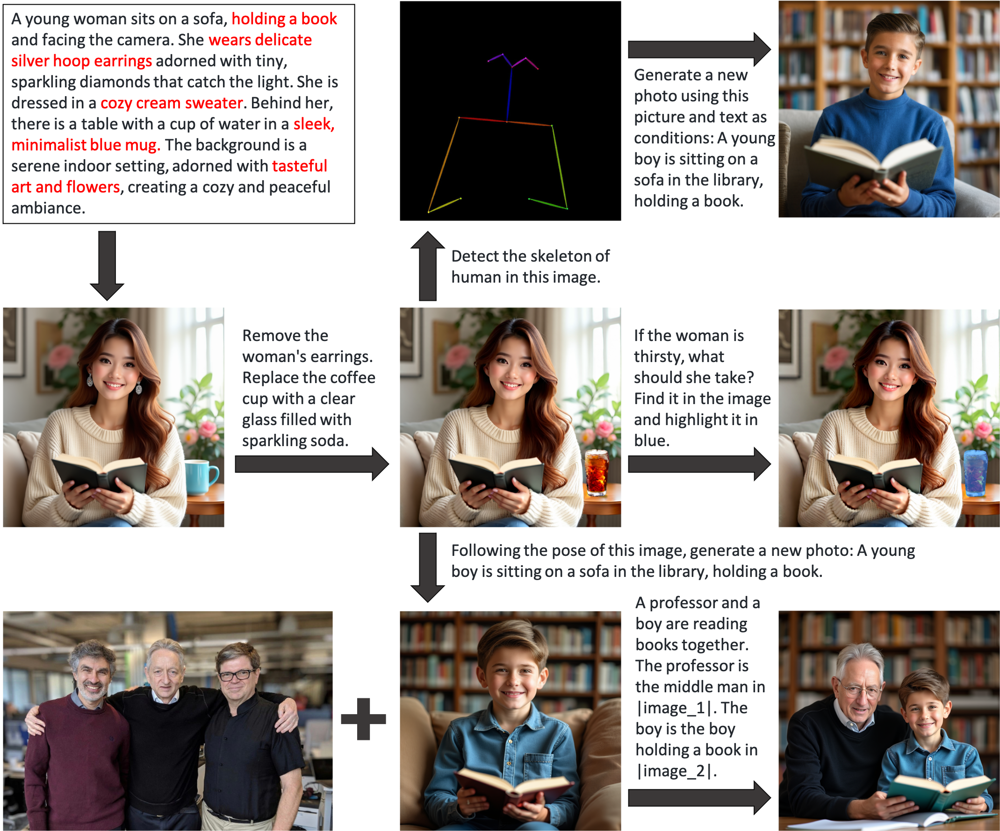
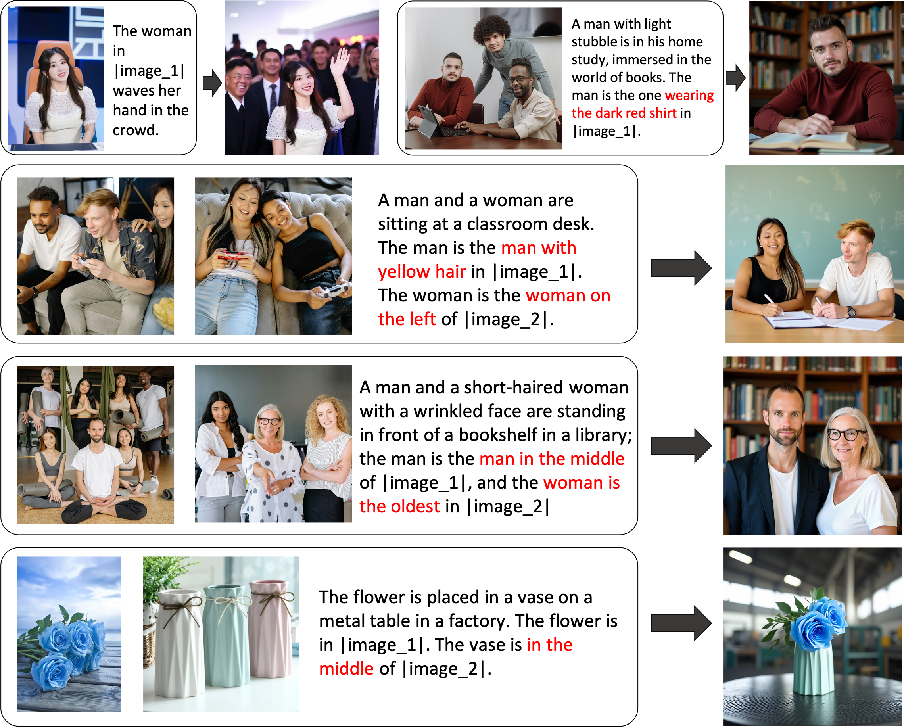

<h1 align="center">OmniGen: Unified Image Generation</h1>


<p align="center">
    <a href="">
        
    </a>
    <a href="https://arxiv.org/abs/2409.11340">
            
    </a>
    <a href="https://huggingface.co/spaces/Shitao/OmniGen">
        
    </a>
    <a href="https://huggingface.co/Shitao/OmniGen-v1">
        
    </a>
</p>

<h4 align="center">
    <p>
        <a href=#2-news>News</a> |
        <a href=#3-methodology>Methodology</a> |
        <a href=#4-what-can-omnigen-do>Capabilities</a> |
        <a href=#5-quick-start>Quick Start</a> |
        <a href="#6-finetune">Finetune</a> |
        <a href="#license">License</a> |
        <a href="#citation">Citation</a>
    <p>
</h4>


## 1. Overview

OmniGen is a unified image generation model that can generate a wide range of images from multi-modal prompts. It is designed to be simple, flexible and easy to use. We provide [inference code](#5-quick-start) so that everyone can explore more functionalities of OmniGen.

Existing image generation models often require loading several additional network modules (such as ControlNet, IP-Adapter, Reference-Net, etc.) and performing extra preprocessing steps (e.g., face detection, pose estimation, cropping, etc.) to generate a satisfactory image. However, **we believe that the future image generation paradigm should be more simple and flexible, that is, generating various images directly through arbitrarily multi-modal instructions without the need for additional plugins and operations, similar to how GPT works in language generation.** 

Due to the limited resources, OmniGen still has room for improvement. We will continue to optimize it, and hope it inspire more universal image generation models. You can also easily fine-tune OmniGen without worrying about designing networks for specific tasks; you just need to prepare the corresponding data, and then run the [script](#6-finetune). Imagination is no longer limited; everyone can construct any image generation task, and perhaps we can achieve very interesting, wonderful and creative things.

If you have any questions, ideas or interesting tasks you want OmniGen to accomplish, feel free to discuss with us: 2906698981@qq.com, wangyueze@tju.edu.cn, zhengliu1026@gmail.com. We welcome any feedback to help us improve the model.


## 2. News
- 2024-10-22: :fire: We release the code for OmniGen. Inference: [docs/inference.md](docs/inference.md) Train: [docs/fine-tuning.md](docs/fine-tuning.md) 
- 2024-10-22: :fire: We release the first version of OmniGen. Model Weight: [Shitao/OmniGen-v1](https://huggingface.co/Shitao/OmniGen-v1) HF Demo: [🤗](https://huggingface.co/spaces/Shitao/OmniGen)  


## 3. Methodology

You can see details in our [paper](https://arxiv.org/abs/2409.11340). 


## 4. What Can OmniGen do?


OmniGen is a unified image generation model that you can use to perform various tasks, including but not limited to text-to-image generation, subject-driven generation, Identity-Preserving Generation, image editing, and image-conditioned generation. **OmniGen don't need additional plugins or operations, it can automatically identify the features (e.g., required object, human pose, depth mapping) in input images according the text prompt.**
We showcase some examples in [inference.ipynb](inference.ipynb). And in [inference_demo.ipynb](inference_demo.ipynb), we show an interesting pipeline to generate and modify a image.

Here is the illustration of OmniGen's capabilities: 
- You can control the image generation flexibly via OmniGen

- Referring Expression Generation: You can generate images by simply referring to objects, and OmniGen will automatically recognize the required objects in the image.


If you are not entirely satisfied with certain functionalities or wish to add new capabilities, you can try [fine-tuning OmniGen](#6-finetune).


## 5. Quick Start


### Using OmniGen
Install via Github:
```bash
git clone https://github.com/staoxiao/OmniGen.git
cd OmniGen
pip install -e .


Here are some examples:
```python
from OmniGen import OmniGenPipeline

pipe = OmniGenPipeline.from_pretrained("Shitao/OmniGen-v1")

# Text to Image
images = pipe(
    prompt="A curly-haired man in a red shirt is drinking tea.", 
    height=1024, 
    width=1024, 
    guidance_scale=2.5,
    seed=0,
)
images[0].save("example_t2i.png")  # save output PIL Image

# Multi-modal to Image
# In prompt, we use the placeholder to represent the image. The image placeholder should be in the format of <|image_*|></img>
# You can add multiple images in the input_images. Please ensure that each image has its placeholder. For example, for the list input_images [img1_path, img2_path], the prompt needs to have two placeholders: <|image_1|></img>, <|image_2|></img>.
images = pipe(
    prompt="A man in a black shirt is reading a book. The man is the right man in <|image_1|></img>."
    input_images=["./imgs/test_cases/two_man.jpg"]
    height=1024, 
    width=1024,
    separate_cfg_infer=False,  # if OOM, you can set separate_cfg_infer=True 
    guidance_scale=3, 
    img_guidance_scale=1.6
)
images[0].save("example_ti2i.png")  # save output PIL image
```
For more details about the argument in inference, please refer to [docs/inference.md](docs/inference.md). 
For more examples for image generation, you can refer to [inference.ipynb](inference.ipynb) and [inference_demo.ipynb](inference_demo.ipynb)

Currently, the generation speed of OmniGen is not very fast. In our experiments (using one A800 GPU), the text-to-image task (1024x1024) takes approximately 30 seconds, and the text-and-image mixed instruction takes about 90 seconds (the speed can be improved by reducing the size of the input images). In fact, OmniGen has 3.8 billion parameters, leaving significant room for speed optimization. We will try to improve the model's efficiency, and welcome the contributions from the community.


### Using Diffusers
Coming soon.


### Gradio Demo

We construct an online demo in [Huggingface](https://huggingface.co/spaces/Shitao/OmniGen).

For the local gradio demo, you need to install `pip install gradio spaces` , and then you can run:
```python
pip install gradio spaces
python app.py
```


## 6. Finetune
We provide a training script `train.py` to fine-tune OmniGen. 
Here is a toy example about LoRA finetune:
```bash
accelerate launch --num_processes=1 train.py \
    --model_name_or_path Shitao/OmniGen-v1 \
    --batch_size_per_device 2 \
    --condition_dropout_prob 0.01 \
    --lr 1e-3 \
    --use_lora \
    --lora_rank 8 \
    --json_file ./toy_data/toy_subject_data.jsonl \
    --image_path ./toy_data/images \
    --max_input_length_limit 18000 \
    --keep_raw_resolution \
    --max_image_size 1024 \
    --gradient_accumulation_steps 1 \
    --ckpt_every 10 \
    --epochs 200 \
    --log_every 1 \
    --results_dir ./results/toy_finetune_lora
```

Please refer to [docs/fine-tuning.md](docs/fine-tuning.md) for more details (e.g. full finetune).


## License
This repo is licensed under the [MIT License](LICENSE). 


## Citation
If you find this repository useful, please consider giving a star ⭐ and citation
```
@article{xiao2024omnigen,
  title={Omnigen: Unified image generation},
  author={Xiao, Shitao and Wang, Yueze and Zhou, Junjie and Yuan, Huaying and Xing, Xingrun and Yan, Ruiran and Wang, Shuting and Huang, Tiejun and Liu, Zheng},
  journal={arXiv preprint arXiv:2409.11340},
  year={2024}
}
```


